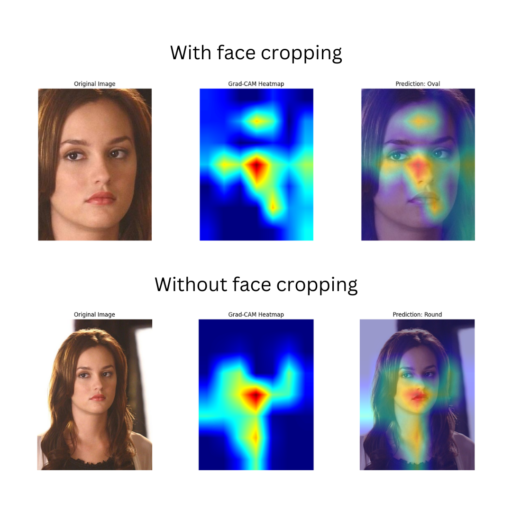

# face_shape_classification

# Face Shape Classification

## Project Overview
This repository contains the implementation of a face shape classification system that categorizes faces into different shape classes (Heart, Oval, Round, Square, and Oblong). The project explores the impact of preprocessing techniques on classification accuracy, specifically comparing full-image classification versus cropped-face classification.

## Key Features
- Face shape classification using deep learning models
- Comparison of two preprocessing approaches:
  1. Using full facial images (baseline)
  2. Using MTCNN for face detection and cropping (improved)
- Analysis of model performance and misclassification patterns

## Methodology

### Data Preprocessing
We implemented two different preprocessing techniques:
1. **Baseline approach**: Images resized and fed directly to the model
2. **MTCNN approach**: Face detection using MTCNN to extract and crop only the facial region before classification

### Model Architecture
The classification model is based on a convolutional neural network with transfer learning, using pre-trained weights and additional custom layers for the face shape classification task.

## Results

Our experiments demonstrate a significant improvement in classification accuracy when using the MTCNN face detection and cropping technique. The model achieved a **5%+ increase in accuracy** compared to using full images.

As shown in the comparison image above, using face cropping helps the model focus specifically on facial features that determine face shape, rather than being distracted by background elements, hair, clothing, or other irrelevant features.

## Analysis of Misclassifications

The most challenging face shape to classify correctly was Oval, which was often confused with Round or Heart shapes. This confusion is understandable given the subtle differences between these face shapes.
